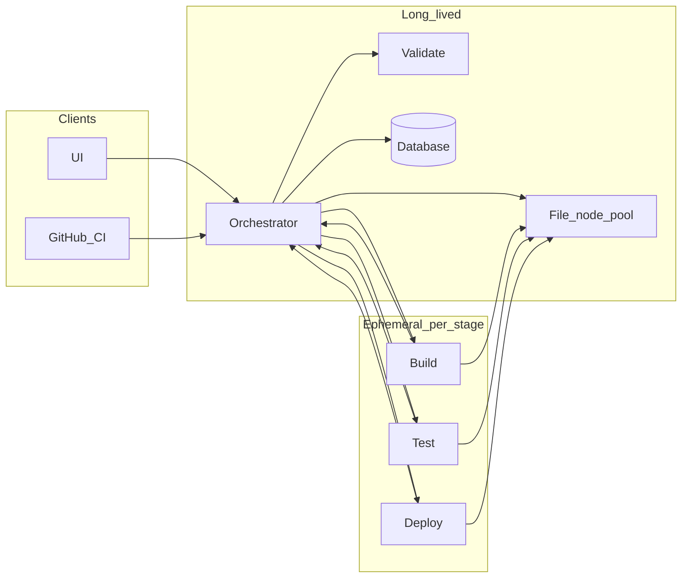

# Architecture

This document describes the microservice-style **nodes** of adaptive-pipe, how they communicate, which processes are long-lived vs ephemeral, and how the design maps to Docker Compose and Kubernetes.

## Node overview

| Node | Role | Typical scaling | Lifetime |
|------|------|-----------------|----------|
| **UI** | Dashboard: org/repo grouping, build list/detail, stages, estimates, kickoff, credentials (via APIs) | Horizontal (stateless behind load balancer) | Always on when the product is available |
| **Orchestrator** | External APIs, queues, stage transitions, persistence coordination, worker dispatch | Horizontal with shared queue + DB (leader or idempotent workers—implementation detail in Phase 2) | Always on |
| **File** | Source and artifact cache; download at pipeline start; file operations for workers | Multi-instance pool with **sticky** assignment per run | Always on |
| **Build** | Compile/package and **language-level** tests | Scale out; many concurrent jobs | Ephemeral per job/stage |
| **Test** | Non-language tests: UI, API/contract, performance (may depend on deploy bringing env up) | Scale out | Ephemeral per job/stage |
| **Deploy** | Deploy to configured targets; IaC/cloud integration (mature over time) | Scale out | Ephemeral; starts after test stage completes |
| **Validate** | Shift-left validation of inputs and criteria; optional cloud prereq checks when enabled | Horizontal | Always on |
| **Database** | Logs, historical status, run metadata, encrypted credential storage | **Single instance** per product prompt (HA optional later—see [CALLOUTS.md](../CALLOUTS.md)) | Always on |

## Communication rules

- **UI** talks only to the **Orchestrator** (HTTP for browser; WebSocket or SSE may be added later for live updates).
- **GitHub CI** (or other callers) talks only to the **Orchestrator** public API.
- **Build, Test, Deploy** workers report completion and stream logs through the **Orchestrator**; they read and write workspace content via the **File** node (or orchestrator-issued presigned paths—implementation choice) but do not call each other directly.
- **Validate** and **File** services are invoked by the **Orchestrator**; they do not initiate cross-worker calls to Build/Test/Deploy.
- **Orchestrator** is the only component that writes authoritative run state to the **Database** (workers send results to the orchestrator).

These rules keep the graph simple for security, observability, and Kubernetes network policies.

## High-level topology

## Kickoff and stage flow

1. **Kickoff** arrives at the Orchestrator (UI or GitHub). The API responds **immediately** once the run is accepted and persisted (see [DATA-AND-API.md](DATA-AND-API.md) for HTTP semantics).
2. The Orchestrator enqueues work; when a **Validate** worker/slot is ready, validation runs. Failure short-circuits the run with a terminal state.
3. On success, the run moves to **File** (fetch/cache sources for the commit). The Orchestrator assigns a **File node** and keeps **sticky** affinity for that run for subsequent file operations.
4. **Build** executes in an ephemeral environment (language-specific image). Results and artifacts are registered via the Orchestrator and stored or referenced through the File layer.
5. **Test** runs non-language tests; coordination with **Deploy** happens when an environment must be up first (ordering and flags are part of pipeline configuration).
6. **Deploy** runs after the testing phase, then the run reaches a terminal success or failure state.
7. The **UI** reads aggregated state from the Orchestrator (which reads from the DB). Skipped stages still appear in order but without progress indicators.

Queues (see [TECH-STACK.md](TECH-STACK.md)) hold pending work per stage; completing a stage enqueues the next stage for that run.

## Sticky node hold

- For pools with multiple instances (File, and similarly Build/Test/Deploy if modeled as named pools), once a run is assigned an instance for a given role, **subsequent steps for that run use the same instance** unless it becomes unhealthy and the Orchestrator performs a controlled reassignment (document failure behavior in Phase 2).

## Docker Compose vs Kubernetes

- **Compose**: one stack file defines long-lived services (UI, Orchestrator, Validate, File, DB, queue) and either a worker pattern (scale replicas) or orchestrator-spawned one-off containers for Build/Test/Deploy depending on implementation.
- **Kubernetes**: long-lived services become Deployments (or StatefulSets where stable identity matters); ephemeral Build/Test/Deploy map naturally to **Jobs** or event-driven scalers (KEDA) driven by the same queue the Orchestrator uses. Autoscaling targets worker queues and CPU/memory per node type.
- Configuration (languages, clouds, IaC) should remain **environment-driven** (ConfigMaps, secrets) so the same images run in Compose and K8s.

## Non-goals for Phase 1

- Exact protobuf/JSON schemas for every internal call (specified in Phase 2 alongside implementation).
- Full cloud/IaC auto-detection (roadmapped post-MVP in [ROADMAP.md](ROADMAP.md)).
