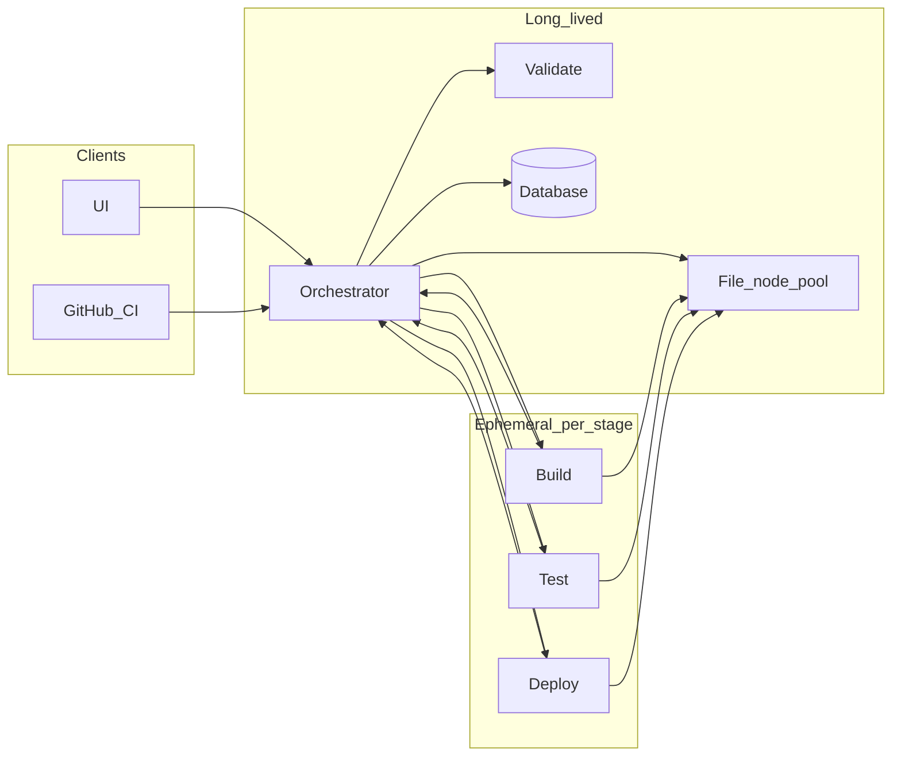

# Architecture

This document describes the microservice-style **nodes** of adaptive-pipe, how they communicate, which processes are long-lived vs ephemeral, worker pooling, and how the design maps to Docker Compose and Kubernetes.

**Product tenancy:** adaptive-pipe is a **multi-tenant SaaS**. The same cluster runs many customers; the Orchestrator, workers, and File layer enforce **per-tenant isolation** (data, credentials, warm pools, retention). See [DATA-AND-API.md](DATA-AND-API.md) and [SECURITY-AND-OPERATIONS.md](SECURITY-AND-OPERATIONS.md).

## Node overview

| Node | Role | Typical scaling | Lifetime |
|------|------|-----------------|----------|
| **UI** | Dashboard: org/repo grouping, build list/detail, stages, ETAs, kickoff, credentials, **tenant platform settings** (warm pool sizes per customer) | Horizontal (stateless behind load balancer) | Always on when the product is available |
| **Orchestrator** | External APIs, Redis queues, stage transitions, persistence coordination, worker dispatch | Horizontal with shared Redis + DB (leader or idempotent workers—implementation detail in Phase 2) | Always on |
| **File** | Source and artifact cache; download at pipeline start; file operations for workers | Multi-instance pool with **sticky** assignment per run | Always on |
| **Build** | Compile/package and **language-level** tests | Scale out; **warm pool** + **scale-from-zero** | Not long-lived per job |
| **Test** | Non-language tests: UI, API/contract, performance (may coordinate with Deploy for env-up) | Same as Build | Not long-lived per job |
| **Deploy** | **MVP**: AWS via **Terraform**. Extensible to more IaC and clouds | Same as Build | Not long-lived per job; starts after test |
| **Validate** | Shift-left validation; optional cloud prereq checks when flagged | Horizontal | Always on |
| **Database** | Logs, historical status, run metadata, encrypted credential storage | **Single logical DB** per deployment; **MVP** = container Postgres | Always on |

**“Always running”** for the control plane (UI, Orchestrator, Validate, File, DB) means those services stay **up** for the deployment. **Build, Test, Deploy** are **not** long-lived per job; capacity is provided by **warm pools** (N idle workers kept ready, **configurable in the UI**) and by **scaling from zero** when pool size is zero.

## Worker warm pool (platform settings)

- The UI **platform settings** page exposes non-negative integers for **Build**, **Test**, and **Deploy** warm pools **for the logged-in tenant** (per pool or per stage type as implemented).  
- **N > 0**: orchestration layer keeps up to **N** idle workers (or container replicas) ready to dequeue immediately.  
- **N = 0**: no standing workers; work still runs by **creating workers on demand** (scale-from-zero), with higher cold-start latency.  
- Maximum caps, cost controls, and admin-only editing of dangerous values align with [SECURITY-AND-OPERATIONS.md](SECURITY-AND-OPERATIONS.md).

## Communication rules

- **UI** talks only to the **Orchestrator** (REST/JSON; WebSocket or SSE may be added later for live updates).
- **GitHub** talks to the **Orchestrator** webhook and HTTP APIs (**github.com** MVP).
- **Build, Test, Deploy** workers report completion and stream logs through the **Orchestrator**; they read and write workspace content via the **File** node (or orchestrator-issued paths/tokens) but do not call each other directly.
- **Validate** and **File** services are invoked by the **Orchestrator**; they do not initiate cross-worker calls to Build/Test/Deploy.
- **Orchestrator** is the only component that writes authoritative run state to the **Database** (workers send results to the orchestrator).

These rules keep the graph simple for security, observability, and Kubernetes network policies. See [SECURITY-AND-OPERATIONS.md](SECURITY-AND-OPERATIONS.md) for threat model and rate limiting.

## High-level topology

## Kickoff and stage flow

1. **Kickoff** arrives at the Orchestrator (UI or GitHub webhook on commit). The API returns **immediately** with a **2xx** success (typically **200 OK**) once the run is accepted and recorded (see [DATA-AND-API.md](DATA-AND-API.md)).
2. The Orchestrator enqueues work on **Redis**; when **Validate** capacity is ready, validation runs. Failure short-circuits the run with a terminal state.
3. On success, the run moves to **File** (fetch/cache sources). The Orchestrator assigns a **File node** and keeps **sticky** affinity for that run.
4. **Build** runs in a worker (possibly from warm pool). Results and artifacts are registered via the Orchestrator and stored or referenced through the File layer (**local volume** MVP).
5. **Test** runs; coordination with **Deploy** when an environment must be up first.
6. **Deploy** runs (**AWS + Terraform** MVP), then the run reaches a terminal state.
7. The **UI** reads state from the Orchestrator. Skipped stages still appear in order but without progress. **ETAs** use a **simple moving average** for MVP (swappable implementation).

## Sticky node hold

- For pools with multiple instances (File, and similarly Build/Test/Deploy if modeled as named pools), once a run is assigned an instance for a given role, **subsequent steps for that run use the same instance** unless it becomes unhealthy and the Orchestrator performs a controlled reassignment (document failure behavior in Phase 2).

## Docker Compose vs Kubernetes

- **Compose**: long-lived services (UI, Orchestrator, Validate, File, Postgres, Redis); worker replicas or one-off containers for Build/Test/Deploy sized from platform settings + queue depth.
- **Kubernetes**: Deployments for control plane; **Jobs** or **Deployments with KEDA** for workers; Redis and Postgres as charts or managed services. **Future**: external DB and object storage swap via config only.
- Configuration (languages, AWS accounts, Terraform backends) remains **environment-driven** (ConfigMaps, secrets).

## Non-goals for Phase 1

- Full automatic IaC/cloud detection (post-MVP; feature-flagged per [SECURITY-AND-OPERATIONS.md](SECURITY-AND-OPERATIONS.md)).
- Non-AWS deploy paths in MVP (designed as add-ons).
